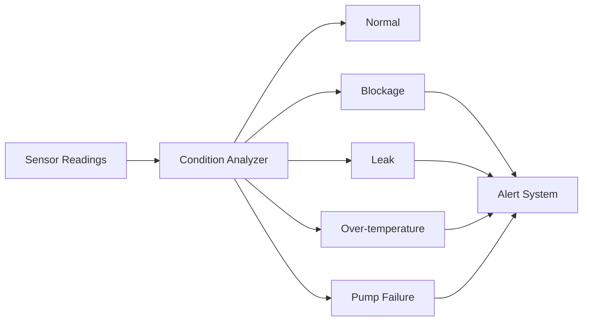
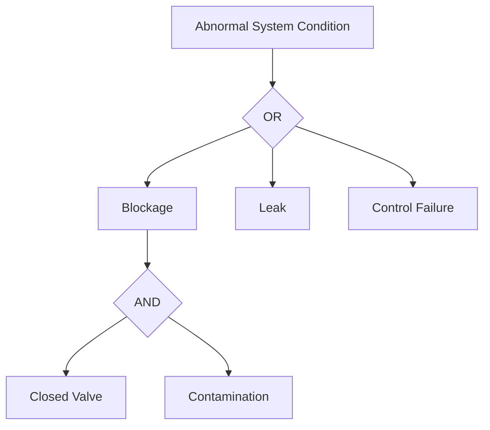
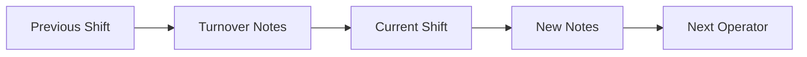
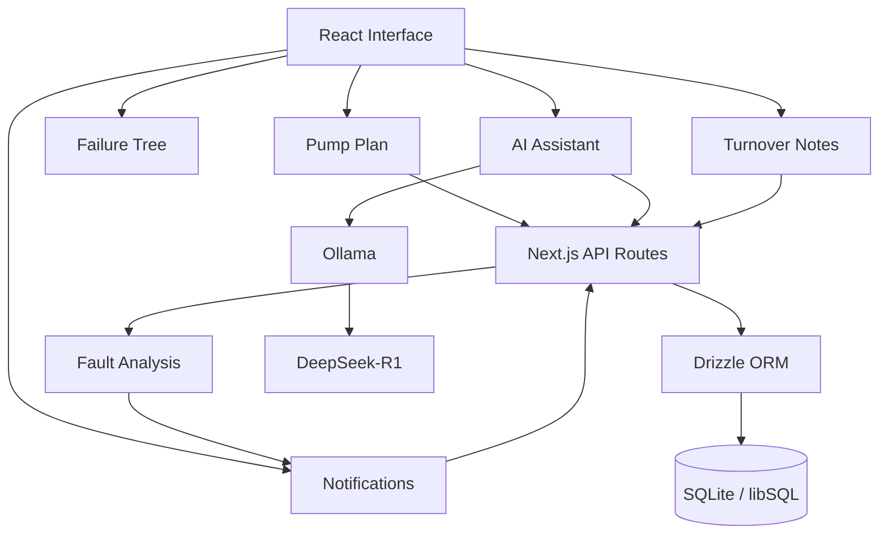

<div align="center">

# MISTI Monitor

### Intelligent monitoring and fault-diagnosis dashboard for a fluid-loop system

A full-stack monitoring application combining sensor visualization, automated fault detection, failure-tree analysis, alerts, shift handover, and a locally hosted AI assistant.


</div>

---

## Overview

**MISTI Monitor** is a monitoring and operator-support application built around a simulated fluid-loop system.

The application combines real-time-style sensor monitoring with automated condition detection, interactive fault-tree analysis, alert management, shift handover notes, and an AI assistant that can answer questions about the monitored system.

The interface is centered around two main system views:

* **Pump Plan** — visualizes the fluid-loop components, operating metrics, and sensor state.
* **Failure Tree** — visualizes possible system failures and their relationships using fault-tree logic.

The application also provides side panels for:

* Alerts
* AI assistance
* Shift turnover notes
* Component information

---

## Core Features

### System Monitoring

The Pump Plan presents the current operating state of the fluid loop.

The dashboard exposes KPIs including:

* Flow
* Pressure
* Temperature
* Overall system status

Selecting a system component opens additional information about that part.

---

## Scenario Simulation

The application includes a scenario simulator for testing different operating conditions.

Available scenarios include:

```text
Normal
Blockage
Leak
Overheat
Pump Failure
```

Each scenario produces sensor readings within predefined ranges representing that condition.

This allows the monitoring and fault-analysis workflow to be demonstrated without requiring a live physical system.

---

## Automated Fault Detection

Sensor readings are evaluated by a deterministic condition classifier.

The classifier consumes readings including:

```text
Temperature
Flow sensor 1
Flow sensor 2
Flow sensor 3
Flow sensor 4
```

and classifies the current system into one of:

```text
normal
block
leak
temp
pumpFail
```

The analysis logic is implemented in:

```text
src/lib/aiAnalize.ts
```

The current classifier uses a decision-tree-style set of thresholds derived from the sensor readings.



When an abnormal condition is detected, the system can automatically generate a corresponding high-severity notification.

---

## Alert Management

MISTI Monitor contains a complete alert lifecycle.

Alerts are categorized as:

```text
Low
Medium
High
```

Operators can:

* View active alerts
* Expand alert details
* Acknowledge alerts
* Resolve acknowledged alerts
* View resolved alert history

The system stores:

* Alert severity
* Title
* Message
* Creation time
* Acknowledgement time
* Resolution time

### Critical Alerts

When a new unacknowledged high-severity alert appears:

1. The alert panel automatically opens.
2. An audible alarm is triggered.
3. The operator can acknowledge the alert.
4. The alert can then be resolved.
5. Resolved alerts move into the history view.

High-severity notifications can also open the corresponding **Failure Tree** for deeper diagnosis.

---

## Failure Tree

The Failure Tree represents possible causes of system faults.

Failure events can be categorized as:

```text
Top Event
Intermediate Event
Basic Event
Failure Mode
AND Gate
OR Gate
```

Each failure node can contain:

* Description
* Severity
* Detection level
* Probability
* Metadata
* Tags
* Child events

The tree supports fault relationships such as:



The interface supports:

* Collapsible branches
* Zooming
* Scrolling
* Focusing on specific failures
* Navigation from critical alerts
* Failure history

---

## AI Assistant

MISTI Monitor includes an operator-focused AI assistant powered by a locally hosted Ollama model.

The default model is:

```text
deepseek-r1:8b
```

Unlike the automated fault classifier, the LLM is used primarily for **operator assistance and explanation**.

When answering a question, the assistant receives context from:

* Pump-plan topology
* Component information
* Failure-tree structure
* Fault-analysis logic
* Recent sensor readings
* System relationships

The sensor context summarizes readings recorded during the previous hour, including:

* Sample count
* Average
* Minimum
* Maximum
* Latest reading
* Timestamp

The assistant is instructed to remain focused on the monitored system rather than answering unrelated questions.

---

## AI Chat History

Questions and responses from the AI assistant are stored in the local database.

Operators can reopen earlier conversations through the chat-history interface.

Each entry stores:

```text
Question
Answer
Created timestamp
```

---

## Shift Turnover

The application includes a shift-handover system for preserving operational context between operators.

Each shift can contain turnover notes.

Operators can:

* View previous shifts
* Expand historical handover notes
* Add notes to the current shift
* Edit current-shift notes
* Review shift start and end times

Previous shifts remain read-only while the current shift remains editable.



---

## Architecture

MISTI Monitor uses a full-stack Next.js architecture.



---

## Technology Stack

| Area                | Technology      |
| ------------------- | --------------- |
| Framework           | Next.js 16.1    |
| UI                  | React 19        |
| Language            | TypeScript      |
| Styling             | Tailwind CSS 4  |
| Database            | SQLite / libSQL |
| ORM                 | Drizzle ORM     |
| AI Runtime          | Ollama          |
| Default LLM         | DeepSeek-R1 8B  |
| Charts              | Chart.js        |
| Markdown            | React Markdown  |
| Icons               | Font Awesome    |
| Database Migrations | Drizzle Kit     |

---

## Database

The application uses SQLite through the libSQL client and Drizzle ORM.

The database schema includes:

```text
users
notifications
ai_chat
shifts
turnover_notes
parts
part_links
sensor_readings
actuator_states
failure_events
failure_event_links
```

### Monitoring Data

The application stores both:

* Sensor readings
* Actuator states

Sensor readings contain:

```text
Sensor / part ID
Timestamp
Value
```

Actuator state records contain:

```text
Part ID
Timestamp
Boolean state
```

---

## Project Structure

```text
src/
├── app/
│   ├── api/
│   ├── layout.tsx
│   └── page.tsx
│
├── components/
│   ├── failure-tree/
│   └── ...
│
├── context/
│   └── NotificationsContext.tsx
│
├── data/
│   ├── failure-tree-store.json
│   └── pump-plan-store.json
│
├── db/
│   ├── migrations/
│   ├── schema/
│   ├── db.ts
│   └── seed.ts
│
├── lib/
│   ├── aiAnalize.ts
│   ├── aiScenarioRanges.ts
│   └── ...
│
├── panels/
│   ├── AIPanel.tsx
│   ├── FailureTreePanel.tsx
│   ├── InfoPanel.tsx
│   ├── NotificationsPanel.tsx
│   ├── PumpPlanPanel.tsx
│   └── TurnoverPanel.tsx
│
└── scripts/
    ├── generate-failure-tree-store.ts
    └── generate-pump-plan-store.ts
```

### `app/api`

Contains the server-side API routes for application data and system operations.

### `db`

Contains the Drizzle database configuration, schema, migrations, and development seed data.

### `panels`

Contains the application's main operator-facing interface panels.

### `lib`

Contains system logic including fault classification and simulated scenario ranges.

### `data`

Contains generated topology information used by the pump-plan and failure-tree interfaces.

---

## Getting Started

### Requirements

You will need:

* Node.js
* npm
* Ollama

### 1. Clone the Repository

```bash
git clone https://github.com/memezsxz/misti.git
cd misti
```

### 2. Install Dependencies

```bash
npm install
```

### 3. Configure the Environment

Create a `.env` file from:

```text
.env.example
```

The default local configuration is:

```env
DB_FILE_NAME="file:./src/db/database.db"
OLLAMA_URL="http://localhost:11434"
OLLAMA_MODEL="deepseek-r1:8b"
```

`OLLAMA_URL` and `OLLAMA_MODEL` are optional because the application contains matching defaults.

### 4. Initialize the Database

Create the local SQLite database file:

```bash
touch src/db/database.db
```

Generate and apply the Drizzle migrations:

```bash
npm run db:gen
npm run db:migrate
```

Seed the development database:

```bash
npm run db:seed
```

If the local database becomes corrupted or the schema needs to be recreated:

```bash
rm src/db/database.db
touch src/db/database.db

npm run db:gen
npm run db:migrate
npm run db:seed
```

### 5. Configure Ollama

Install Ollama, then download the default model:

```bash
ollama pull deepseek-r1:8b
```

Start Ollama:

```bash
ollama serve
```

To use another compatible model, set:

```env
OLLAMA_MODEL="your-model-name"
```

in `.env`.

### 6. Start the Application

```bash
npm run dev
```

Open:

```text
http://localhost:3000
```

---

## Available Scripts

### Development

```bash
npm run dev
```

### Production Build

```bash
npm run build
```

### Production Server

```bash
npm start
```

### Lint

```bash
npm run lint
```

### Generate Database Migrations

```bash
npm run db:gen
```

### Apply Database Migrations

```bash
npm run db:migrate
```

### Seed Development Data

```bash
npm run db:seed
```

### Generate Pump-Plan Store

```bash
npm run gen:parts_info
```

### Generate Failure-Tree Store

```bash
npm run gen:failure_tree_info
```

---

## Fault-Analysis Scenarios

The simulation currently defines sensor ranges for:

| Condition        | Purpose                      |
| ---------------- | ---------------------------- |
| Normal           | Baseline operation           |
| Blockage         | Restricted fluid flow        |
| Leak             | Fluid-loss condition         |
| Over-temperature | Excessive system temperature |
| Pump Failure     | Pump malfunction condition   |

These ranges are located in:

```text
src/lib/aiScenarioRanges.ts
```

and are used by the simulation environment to generate representative operating states.

---

## Project Status

MISTI Monitor is a completed monitoring prototype demonstrating:

* Full-stack Next.js development
* Sensor-data modelling
* System visualization
* Automated fault classification
* Failure-tree analysis
* Alert lifecycle management
* Local LLM integration
* Context-grounded operator assistance
* Shift handover workflows
* SQLite and Drizzle ORM
* Interactive React interfaces

---

## License

This project is licensed under the [GNU General Public License v3.0](LICENSE).
